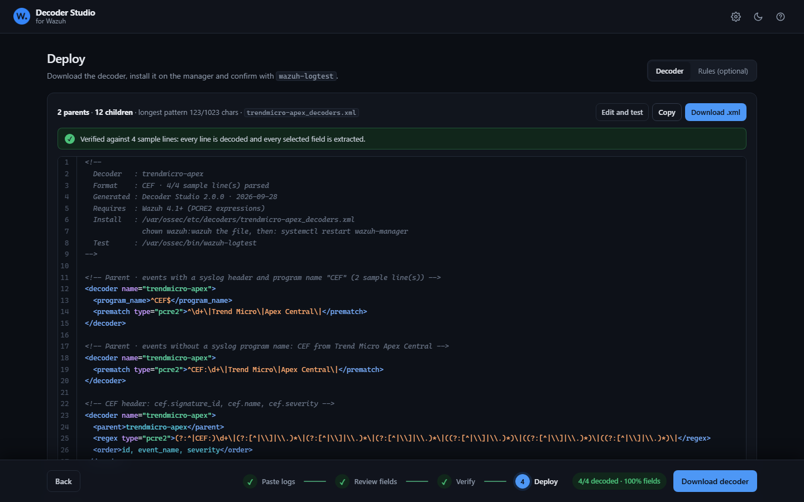
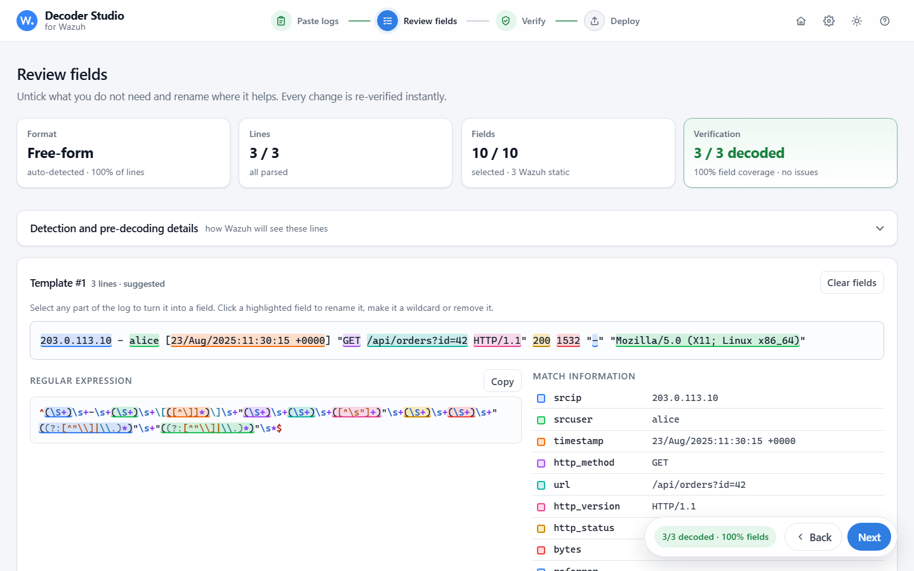
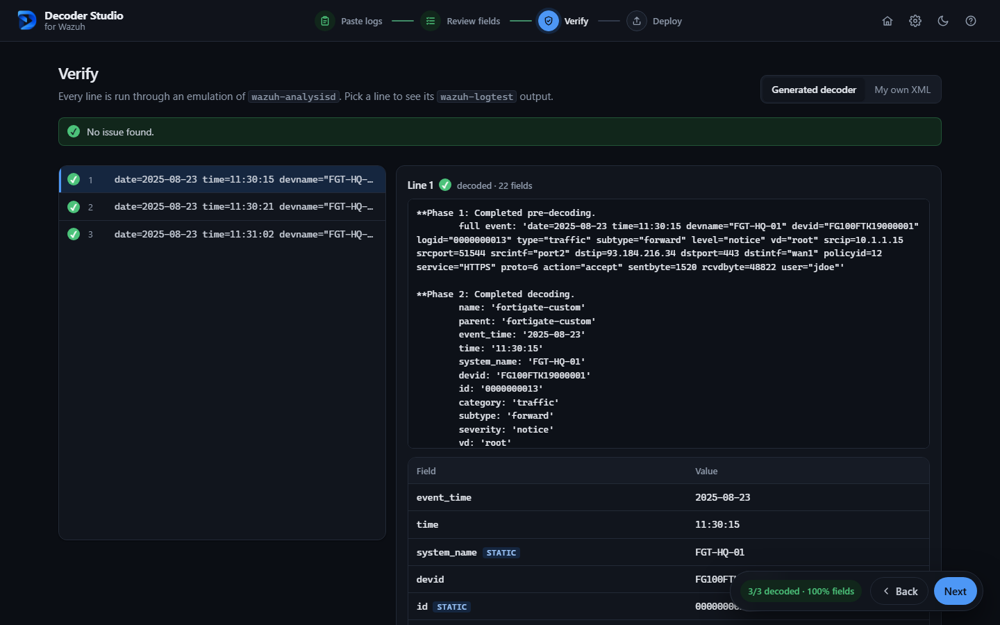
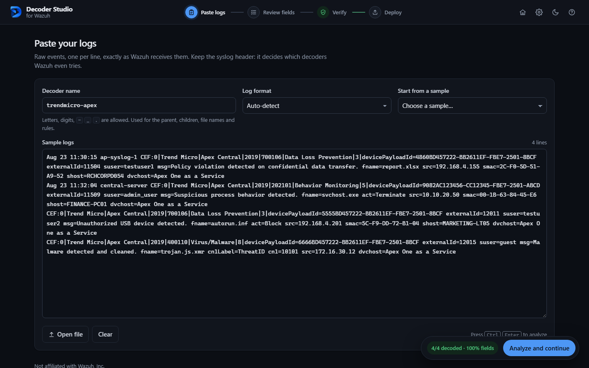
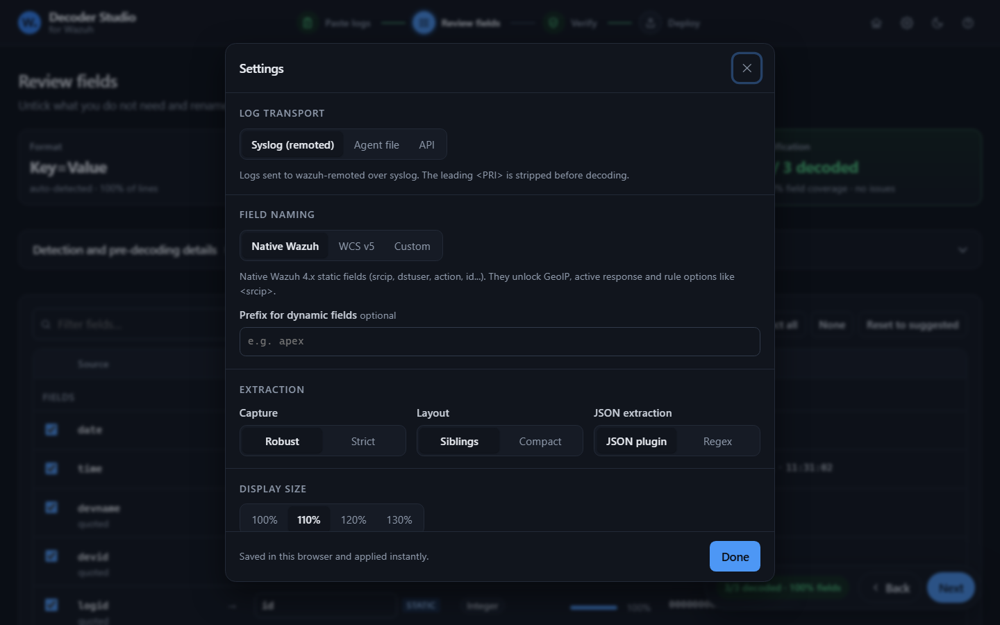

# Decoder Studio

**Build Wazuh decoders that actually work, from a handful of sample logs.**

Decoder Studio turns raw log samples into verified Wazuh decoders and companion rules. Paste a few events, review the fields it proposes, and download a decoder that has already been tested against every sample line by a faithful emulation of `wazuh-analysisd`.

It supports CEF, LEEF, key=value, JSON, CSV, XML, RFC 5424 syslog and free-form text. Everything runs in your browser: no server, no build step, no dependency, nothing uploaded.



## Contents

- [Quick start](#quick-start)
- [Why this exists](#why-this-exists)
- [Features](#features)
- [Workflow](#workflow)
- [Settings](#settings)
- [Command line](#command-line)
- [How it works](#how-it-works)
- [Project layout](#project-layout)
- [Limitations](#limitations)
- [License](#license)

## Quick start

```bash
git clone https://github.com/Zvckster/decoder-studio.git
cd decoder-studio
# then open public/index.html in any modern browser
```

No installation is needed. The page works from `file://`, offline and in air-gapped networks, which makes it safe to use with production logs.

To try it immediately, pick one of the 14 bundled samples in the **Start from a sample** menu.

## Why this exists

Onboarding a new log source is one of the most repetitive tasks in a Wazuh deployment, and it is easy to get subtly wrong. Hand-written decoders often load without any error but silently drop events, because Wazuh applies rules that are not obvious from the documentation.

Decoder Studio encodes those rules. Each behaviour below was verified against the `wazuh-analysisd` source code (`cleanevent.c`, `decoder.c`, `decoders_list.c`, `decode-xml.c`, `os_xml.c`, `json_decoder.c`):

| Wazuh behaviour | Typical mistake | What Decoder Studio does |
|---|---|---|
| `<prematch>` defaults to OS_Regex, where `\|` means OR | `CEF:0\|Vendor\|Product\|` matches any log containing `CEF:0` | Generates PCRE2 with escaped pipes, and flags the mistake in existing XML |
| The pre-decoder turns `host CEF:0\|...` into `program_name = "CEF"` with a body starting at `0\|...` | A `CEF:` prematch never matches CEF forwarded over syslog | Emulates pre-decoding and generates both a `<program_name>` parent and a `<prematch>` parent when needed |
| Events carrying a program name are only matched against decoders that declare `<program_name>` | Prematch-only decoders are never tried for syslog applications | Routes parents exactly like analysisd routes events |
| All sibling decoders (children sharing a name) run, and a failing sibling is skipped | One large regex drops the whole event when a field is missing or moves | One sibling per field by default, with an optional compact layout for fields that are always present in a fixed order |
| Element content of 1024 bytes or more is rejected | Wide logs break the decoder file at load time | Keeps every pattern under the limit |
| The XML reader does not decode entities, and a raw `<` starts a tag | `&lt;` is matched literally, lookbehinds break the file | Writes `<` as `\x3c` and never emits lookbehinds or named groups |
| Siblings cannot have a `<prematch>` | `wazuh-analysisd` refuses to start | Never generated, and flagged in existing XML |
| The built-in `json` decoder is loaded before custom decoders | A custom parent for plain JSON is never reached | Produces rules on `<decoded_as>json</decoded_as>` instead of a decoder that would never run |
| JSON_Decoder has its own static keys (`systemname`, no `user` alias) | Rules target a field that is never filled | Simulated, and used in the generated rules |
| OS_Regex and OS_Match are case-insensitive, PCRE2 is not | Unexpected matches or misses | Emulated per engine |

## Features

### Log formats

| Format | Details |
|---|---|
| CEF | Header cells (signature ID, name, severity), escaped values, values with spaces, `csNLabel` custom field names |
| LEEF 1.0 / 2.0 | Tab, custom and hexadecimal delimiters, literal `\t` separators, non-compliant headers |
| Key=value | Auto-detected pair separator, key/value delimiter and quoting, unquoted values containing spaces (Fortinet, Sophos, Check Point, auditd...) |
| JSON | Plain NDJSON, JSON after a syslog program name, JSON after a text prefix; pretty-printed input is compacted |
| CSV / TSV | Comma, semicolon, tab or pipe, quoted cells, header row detection (Palo Alto style CSV and exports) |
| XML | Single-line events, attributes, Windows `<Data Name="...">` elements |
| RFC 5424 | Envelope fields and structured data, with any of the formats above as payload |
| Free-form text | Event template mining with click-to-edit fields |

### Free-form template mining

Unstructured lines are clustered into event templates (a lightweight take on the Drain log-parsing algorithm). Values that change become fields and are named from their context: `from 10.0.0.1 port 22` gives `srcip` and `srcport`, `for alice` gives `dstuser`, and access logs get `request`, `http_status`, `bytes` and `user_agent`.

Click any token to switch it between literal and field, or Shift+click to capture the rest of the line.



### Field naming and types

- Three naming schemes: Native Wazuh static fields (`srcip`, `dstuser`, `action`, `id`, `url`, `status`, `system_name`...), WCS v5 (the ECS-based schema of Wazuh 5, unknown fields under `custom.*`), or your own remembered mapping. Static fields unlock GeoIP enrichment, active response and dedicated rule options.
- About 300 vendor keys are mapped to 45 field concepts (CEF dictionary, LEEF attributes, Fortinet, Palo Alto, Check Point, Windows, common JSON keys).
- Type inference for IPv4, IPv6, IP:port, MAC, UUID, hashes, epoch, numbers, ISO-8601, syslog and HTTP dates, e-mail, URL, paths, file names, host names, user agents and HTTP request lines. Types drive naming, linting and the optional strict capture mode.

### Built-in tester

Every edit regenerates the decoder and runs it against all sample lines. For each line you get `wazuh-logtest` style output, the decoding trace, and field coverage (expected, extracted and mismatched values).

You can also paste an existing decoder file (OS_Regex, OS_Match, PCRE2, `<var>`, offsets, siblings, JSON_Decoder) and test it against your logs. It runs in a sandboxed Web Worker with a timeout, so a regex that backtracks catastrophically cannot freeze the page, and the linter explains what is wrong.



### Companion rules

A decoder alone never raises an alert, so a rules file is generated alongside it:

- a base rule on the decoder (or on the built-in `json` decoder with a discriminating field),
- one rule per event ID seen in the samples, labelled with the event name found next to it (for example the CEF *Name*), with a level derived from its severity,
- severity tiers as a fallback for IDs that were not in the samples.

### Linter

Checks the 1024-byte limit, raw `<`, XML entities, the OS_Regex `|` pitfall, capture and `<order>` mismatches, invalid field names, the 256-field limit, parents without prematch, collisions with built-in decoder names, and catastrophic or polynomial backtracking.

## Workflow

The app is a four-step flow, with the steps in a bar at the bottom of the screen and a live verification badge next to them.

1. **Paste logs** exactly as the manager receives them, syslog header included. The header decides which decoders Wazuh even tries. 5 to 50 varied lines work best. Empty lines are removed automatically, and long lines wrap so nothing hides off-screen. You can also open or drop a file, or start from a sample.
2. **Review fields.** Untick what you do not need and rename. Sample values show up to three lines so you can judge each field.
3. **Verify.** Every line runs through the emulation, with `wazuh-logtest` style output, a decoding trace and per-field coverage. You can also test your own XML here.
4. **Deploy.** Download the decoder (and optionally the rules) and follow the install commands.

```bash
sudo cp mysource_decoders.xml /var/ossec/etc/decoders/
sudo chown wazuh:wazuh /var/ossec/etc/decoders/mysource_decoders.xml
sudo systemctl restart wazuh-manager
sudo /var/ossec/bin/wazuh-logtest    # paste a line to confirm
```

The rules are optional. A decoder only extracts fields and Wazuh raises alerts from rules, so the generated rules are a starting point: a base rule on the decoder, one rule per event ID seen in the samples, and severity tiers.



## Settings

Settings live behind the gear icon, are saved in the browser and apply instantly.



| Setting | Default | Meaning |
|---|---|---|
| Log transport | Syslog | **Syslog (remoted)** strips the leading `<PRI>`. **Agent file** keeps lines exactly as written. **API** covers events posted to the Wazuh server API (`POST /events`), which reach analysisd as sent, usually JSON |
| Field naming | Native Wazuh | **Native Wazuh** uses the 4.x static fields (`srcip`, `dstuser`...). **WCS v5** uses the Wazuh Common Schema of Wazuh 5 (ECS-based names such as `source.ip`), with fields outside the schema under `custom.*`. **Custom** is your own mapping: every rename is remembered and suggested again, and the mapping can be exported, imported or cleared |
| Capture | Robust | Values are delimited by the format grammar. Strict mode also enforces the inferred type |
| Layout | Siblings | One child decoder per field. Compact merges always-present, fixed-order fields into chunked regexes |
| JSON extraction | Plugin | `JSON_Decoder` keeps every key with its JSON name. Regex mode extracts selected keys so they can be renamed |
| Custom parent prematch | none | Advanced, per source. Overrides the inferred fingerprint (refused if it does not compile or can backtrack catastrophically) |

The parent prematch is built from the earliest stable fields of the line (for example `^date=... time=... devname=` for FortiGate), so logs from other sources are rejected on their first characters.

Keyboard: `Ctrl+Enter` analyzes, `Alt+1` to `Alt+4` go to a step.

Deep links are available for demos, for example `index.html?sample=cef-trendmicro&step=4&theme=dark`.

## Command line

The same engine runs in Node.js 18 or later, which makes it usable in scripts and CI pipelines:

```bash
# generate a decoder and its rules
node cli.js generate samples.log --name mysource --out mysource_decoders.xml --rules mysource_rules.xml

# test any decoder file against logs (wazuh-logtest style output)
node cli.js test mysource_decoders.xml samples.log

# machine-readable results
node cli.js test existing_decoders.xml samples.log --json
```

Options: `--format`, `--scheme wazuh|wcs|custom`, `--prefix`, `--mode robust|strict`, `--strategy siblings|compact`, `--json-mode plugin|regex`, `--transport syslog|file|api`, `--rule-id`. The exit code is `1` when verification finds errors.

## How it works

1. **Pre-decoding.** Each line goes through a port of Wazuh's `OS_CleanMSG`, which extracts the timestamp, host name and program name exactly as the manager does.
2. **Detection.** Every format scores every line, and the majority wins. Mixed inputs are reported.
3. **Parsing and aggregation.** Fields are collected with their presence, distinct values, quoting and inferred type, then named.
4. **Generation.** Parents are built per routing group (program name or not), children per field, all in PCRE2 that is safe inside Wazuh's XML reader.
5. **Verification.** The decoder is loaded and evaluated by a port of `OS_AddOSDecoder` and `DecodeEvent`, and the extracted values are compared with what the parser saw in each line.

## Project layout

```
public/                   the website (everything that gets published)
  index.html              user interface
  assets/app.css          design tokens, light and dark themes, components
  assets/app.js           UI controller (state, rendering, template editor, tester)
  assets/wazuh.png        logo and favicon
  engine/
    core.js               utilities, PCRE2-safe escaping, module loader
    predecoder.js         port of OS_CleanMSG
    valuetypes.js         type inference and strict patterns
    fieldmap.js           vendor keys to Native Wazuh and WCS names
    formats/              cef, leef, kv, json, csv, xml, template
    analyzer.js           detection, parsing, aggregation, naming
    generator.js          decoder model and XML output
    rules.js              companion rules
    regex.js              PCRE2, OS_Regex and OS_Match translation, backtracking checks
    xmlreader.js          Wazuh-style decoder file reader
    simulator.js          port of DecodeEvent and OS_AddOSDecoder
    linter.js             static checks and coverage verification
    samples.js            sample library
cli.js                    command line
tests/                    test suite (node:test)
docs/                     screenshots
wrangler.jsonc            Cloudflare Workers static assets configuration
```

Engine files are plain scripts registered through `WDG_MODULE(fn)`. The browser loads them directly, Node loads them through `public/engine/node.js`, and the UI rebuilds them inside a Web Worker for sandboxed tests.

### Hosting

The site is static, so any static host works. On Cloudflare Workers, `npx wrangler deploy` publishes the `public/` folder as configured in `wrangler.jsonc`. On Cloudflare Pages, set no build command and `public` as the output directory.

Run the tests with:

```bash
npm test
```

The 81 tests cover the pre-decoder, every sample end to end, XML round trips, Wazuh semantics (siblings, offsets, routing, JSON plugin), the regex translation layer and the size limits.

## Limitations

- The simulator emulates analysisd's decoding phase, not all of Wazuh's built-in decoders. A built-in decoder with a matching `<program_name>` could still take an event first, so confirm with `wazuh-logtest` after deploying.
- OS_Regex is approximated with JavaScript's backtracking semantics. Generated decoders always use PCRE2.
- PCRE2 in decoders requires Wazuh 4.1 or later.

## License

[MIT](LICENSE). Decoder Studio is an independent project and is not affiliated with Wazuh, Inc.
